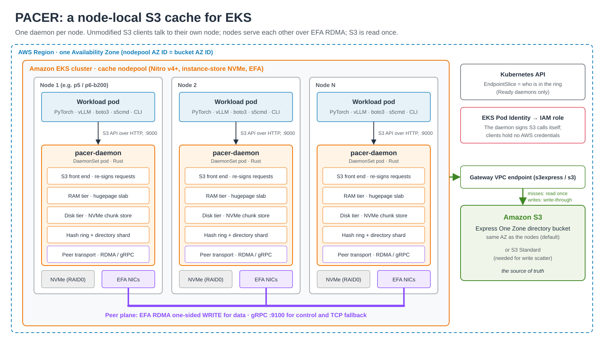
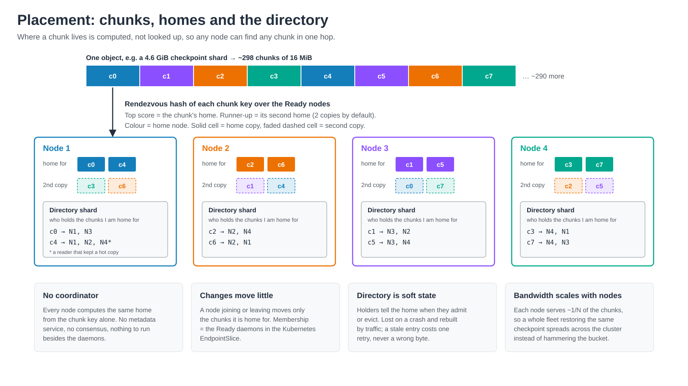
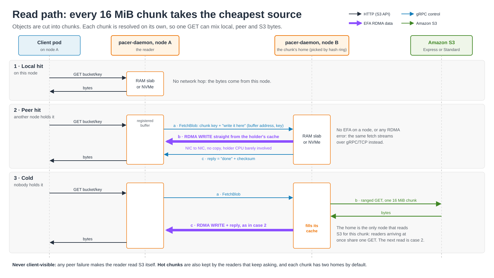
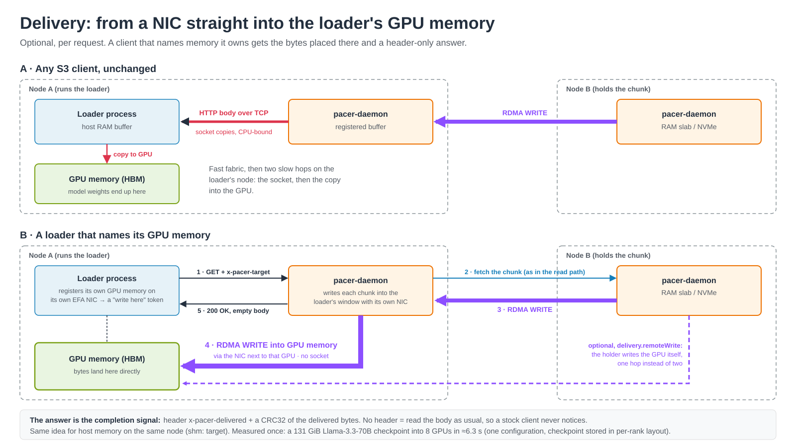

# Architecture diagrams

Six pictures of how PACER works, in reading order. Each one shows the default `node` auth
mode and the shipped chart defaults. A picture leaves things out. The notes under each one
say what it simplifies and link to the ADR that has the full rule.

The files are plain SVG, with no scripts, web fonts or embedded images. GitHub renders them
inline, a change to one diffs as text, and a slide tool can import one as editable shapes.

## 1. System overview

Every node in the cache nodepool runs one daemon. Pods on that node point an unmodified S3
client at it. Daemons serve each other over the peer plane, and S3 is read on a miss and
written on every write.

- The RAM tier is the hugepage slab only when `efa.hugepages` is set. Without a slab, both
  tiers are the foyer hybrid cache ([ADR-0028](../adr/0028-cache-ram-tier-is-the-registered-arena.md),
  [ADR-0038](../adr/0038-chunk-store-is-the-default-disk-tier.md)).
- EFA is optional. A daemon without it, or a peer that fails over RDMA, uses gRPC
  ([ADR-0003](../adr/0003-efa-rdma-cross-node-reads-only-grpc-fallback.md)).
- "Clients hold no AWS credentials" is the `node` mode. In `requester` mode each client keeps
  its own credentials and S3 authorizes every request
  ([ADR-0041](../adr/0041-requester-identity-auth-mode.md)).

## 2. Placement

A chunk's home is a pure function of its key and the ring's membership, so every node agrees on
it without asking anyone. The home is also the directory shard for its chunks: it records which
other nodes hold a copy.

- Membership is the set of Ready daemons in the release's EndpointSlice
  ([ADR-0014](../adr/0014-ring-ownership-wire-contract.md)).
- Two homes per chunk is the default `config.replicationR: 2`. A reader also keeps its own copy
  of a peer's chunk from its second fetch (`config.localAdmissionThreshold: 2`) and registers
  that copy with the home ([ADR-0016](../adr/0016-multi-copy-replication.md)).
- The directory is soft state: nothing persists it, and a stale entry costs one retry
  ([ADR-0017](../adr/0017-sharded-soft-state-directory.md)).
- Chunking and the 16 MiB default: [ADR-0015](../adr/0015-chunk-granular-caching.md).

## 3. Read path

Each chunk of a GET is resolved on its own, so one response can combine local, peer and S3
bytes.

- The holder drives the transfer: the reader names a registered buffer, the holder writes
  into it, and the gRPC reply is the completion
  ([ADR-0018](../adr/0018-holder-driven-rdma-write-data-plane.md),
  [ADR-0024](../adr/0024-registered-arena-rdma-buffers.md)).
- The home is where a cold chunk is filled, so readers arriving at once share one backend
  GET ([ADR-0012](../adr/0012-owner-read-through-cluster-fill.md),
  [ADR-0040](../adr/0040-one-backend-read-per-chunk-key.md)).
- If a peer fails, the reader reads S3 itself and does not fill. The client never sees the
  failure ([ADR-0012](../adr/0012-owner-read-through-cluster-fill.md)).

## 4. Write path

A write is acknowledged only after S3 has it. On S3 Standard, a large write also leaves its
chunks cached on their homes, so the next read of a checkpoint that was just saved is warm.

- Before forwarding, a write learns the size of the object it replaces, so it can purge every
  chunk of it ([ADR-0007](../adr/0007-write-through-read-after-write.md),
  [ADR-0042](../adr/0042-invalidation-measures-the-replaced-object.md)).
- Write scatter applies to a `PUT` of a new key over 128 MiB on S3 Standard, and is on by
  default there. An overwrite, and every write on Express, takes the write-through path. A
  scattered object's ETag is the multipart `-N` form
  ([ADR-0032](../adr/0032-write-scatter-populates-the-cache.md),
  [docs/helm/write-scatter.md](../helm/write-scatter.md)).
- When it publishes, the coordinator also invalidates every second home a window's bytes did
  not land on ([ADR-0043](../adr/0043-scatter-fallback-invalidates-its-home.md)).

## 5. Delivery into client memory

A cooperating client can name memory it owns. The daemon writes the object there and answers
with headers only, so no body crosses a socket. A client that names no target gets an
ordinary response.

- `nic:` targets are memory the client registered on its own NIC, including GPU memory. They
  ride the RDMA transport, which the base chart leaves off
  ([ADR-0026](../adr/0026-client-supplied-target-memory.md),
  [ADR-0030](../adr/0030-delivery-registration-belongs-to-the-memory-owner.md)).
- By default the reading node's daemon writes into the client's window. With
  `delivery.remoteWrite: true` the holder writes it directly, the dashed arrow
  ([docs/helm/delivery.md](../helm/delivery.md)).
- The 6.3 s figure is the README's measured result, and it depends on a checkpoint stored in
  a per-rank layout ([section 6](#6-loading-vllm-weights-stored-per-gpu-rank)). The exporter
  and loader for that layout are not published.

## 6. Loading vLLM weights stored per GPU rank

A tensor-parallel rank needs a slice of most tensors, and in a published checkpoint a third of
those bytes are not contiguous. Storing each rank's parameters as one object, in the order the
rank holds them in memory, turns the load into sequential writes into one GPU block.

- The layout is recorded from vLLM's own `weight_loader` calls rather than recomputed, so it
  matches whatever vLLM would have built, quantized weights included. The manifest pins the
  vLLM version and the shape of the load, and any mismatch refuses the load instead of
  falling back ([ADR-0037](../adr/0037-checkpoint-stored-in-rank-memory-layout.md)).
- The cost is one converted copy per TP and PP width. The published-safetensors loader stays
  the default because it needs no conversion.
- The byte shares and the two-thirds waiting figure come from one recorded 70B load at TP=8
  ([ADR-0037](../adr/0037-checkpoint-stored-in-rank-memory-layout.md)). The 6.3 s result is
  in [docs/status.md](../status.md#performance). The converter and loader for this layout are
  not published yet.
